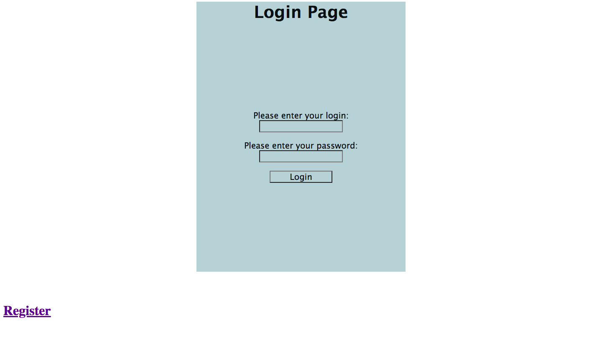
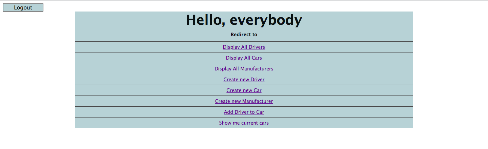
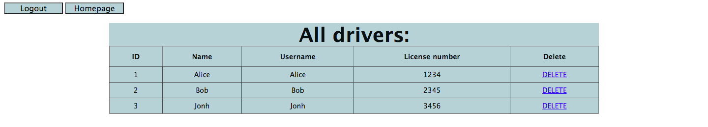

#  Taxi-service 

It's an educational project that reflects the work of a taxi service.
The user can add a new driver, 
add a new car to the service, add a car manufacturer, 
assign a driver to a specific car, 
and display all available information about drivers, 
cars, and manufacturers. 
The service has convenient navigation between pages.

## Features

- Authentication
- Add driver to car
- Add new driver
- Add new car
- Add new manufacturer
- Display current cars
- Display all drivers
- Display all cars
- Display all manufacturers

## Used technologies

- Java version 17.0.2
- MySQL version 8.0.22
- Tomcat version 9.0.73
- Java Servlets version 4.0.1
- JSTL version 1.2
- JDBC version 4.2
- Maven version 3.8.0

## How to run the project

- Clone this project repository
- Run the SQL-script located in `src/main/resources/init_db.sql` to initialize the database
- Put your values of `URL`, `USERNAME`, `PASSWORD`, `JDBC_DRIVER` in `src/main/java/util/ConnectionUtil`
- Build the project using Maven: `mvn clean install`
- Deploy the generated WAR file to servlet container (this project used Tomcat)
- After deploying the project, open the [link](http://localhost:8080) in your web browser to access the taxi service.

## Structure

- Controller:
   - Authentication controllers:
      - LoginController - to login
      - LogoutController - to logout
   - Car controllers:
      - AddCarController - to create new car 
      - AddDriverToCarController - to add driver to the car
      - DeleteCarController - to delete car
      - GetAllCarsController - to display all cars
   - Driver controllers:
      - AddDriverController - to register driver
      - DeleteDriverController - to delete driver
      - GetAllDriversController - to display all drivers
      - GetMyCurrentCarsController - to display cars on current account
   - Manufacturer controllers:
      - AddManufacturerController - to add new manufacturer
      - DeleteManufacturerController - to delete manufacturer
      - GetAllManufacturersController - to display all manufacturers
   - IndexController - homepage
- Dao:
   - CarDaoImpl - processes car model from DB
   - DriverDaoImpl - processes driver model from DB
   - ManufacturerDaoImpl - processes manufacturer model from DB
- Exception: 
   - AuthenticationException 
   - DataProcessingException
- Model:
   - Car - car model class
   - Driver - driver model class
   - Manufacturer - manufacturer model class
- Service:
   - AuthenticationServiceImpl - processes authentication logic
   - CarServiceImpl - processes car's CRUD logic
   - DriverServiceImpl - processes driver's CRUD logic
   - ManufacturerServiceImpl - processes manufacturer's CRUD logic
- Util:
   - ConnectionUtil - provides a connection to the database
- Resources:
   - init_db.sql - sql script to initialize the database
- Webapp:
   - jsp files
   - css file 
   - web.xml - configuration file
- Docs:
   - images - images of service pages
## How does it look

