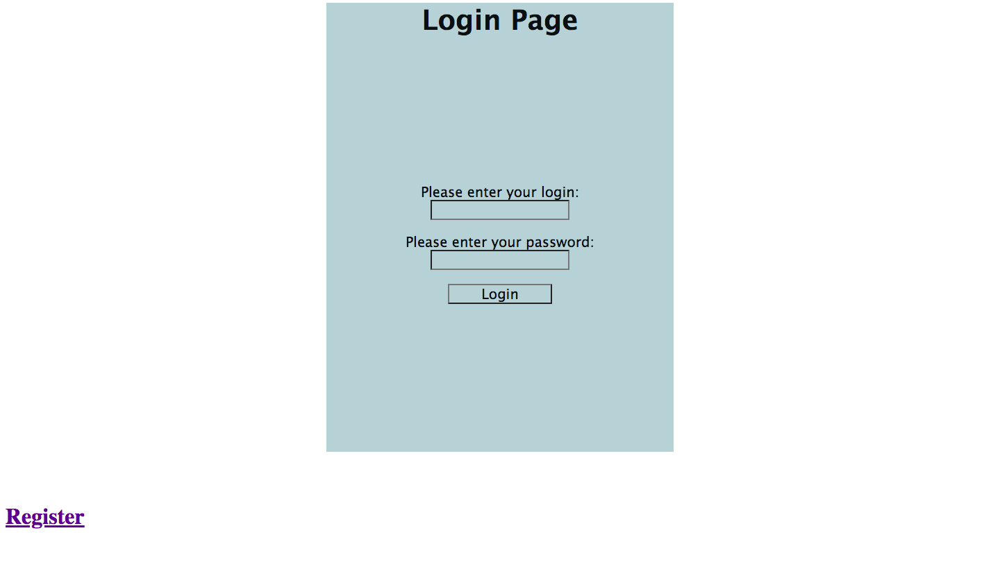
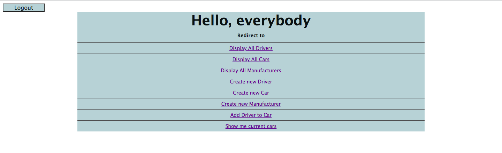
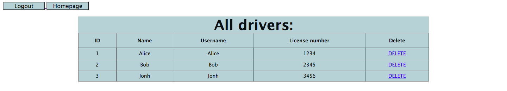

# Taxi-service

It's an educational project that reflects the work of a taxi service.
The user can add a new driver, 
add a new car to the service, add a car manufacturer, 
assign a driver to a specific car, 
and display all available information about drivers, 
cars, and manufacturers. 
The service has convenient navigation between pages.

## Features

- Authentication
- Add driver to car
- Add new driver
- Add new car
- Add new manufacturer
- Display current cars
- Display all drivers
- Display all cars
- Display all manufacturers

## Used technologies

- Java version 17.0.2
- MySQL version 8.0.22
- Tomcat version 9.0.73
- Java Servlets version 4.0.1
- JSTL version 1.2
- JDBC version 4.2
- Maven version 3.8.0

## How to run the project

- Clone this project repository
- Run the SQL-script located in `src/main/resources/init_db.sql` to initialize the database
- Put your values of `URL`, `USERNAME`, `PASSWORD`, `JDBC_DRIVER` in `src/main/java/util/ConnectionUtil`
- Build the project using Maven: `mvn clean install`
- Deploy the generated WAR file to servlet container (this project used Tomcat)
- After deploying the project, open the [link](http://localhost:8080) in your web browser to access the taxi service.

## How does it look

